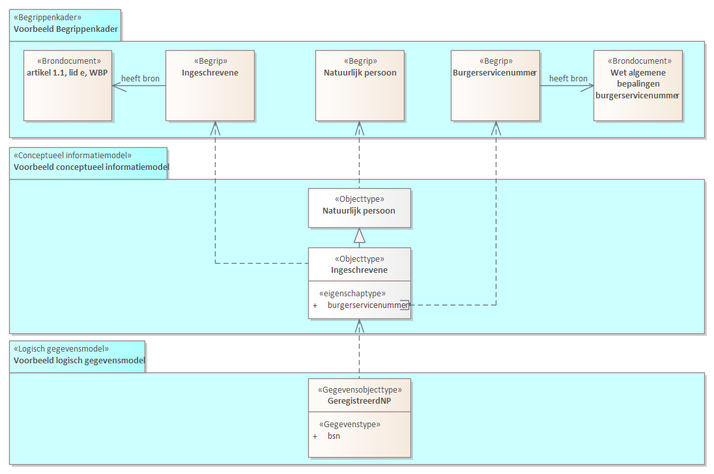
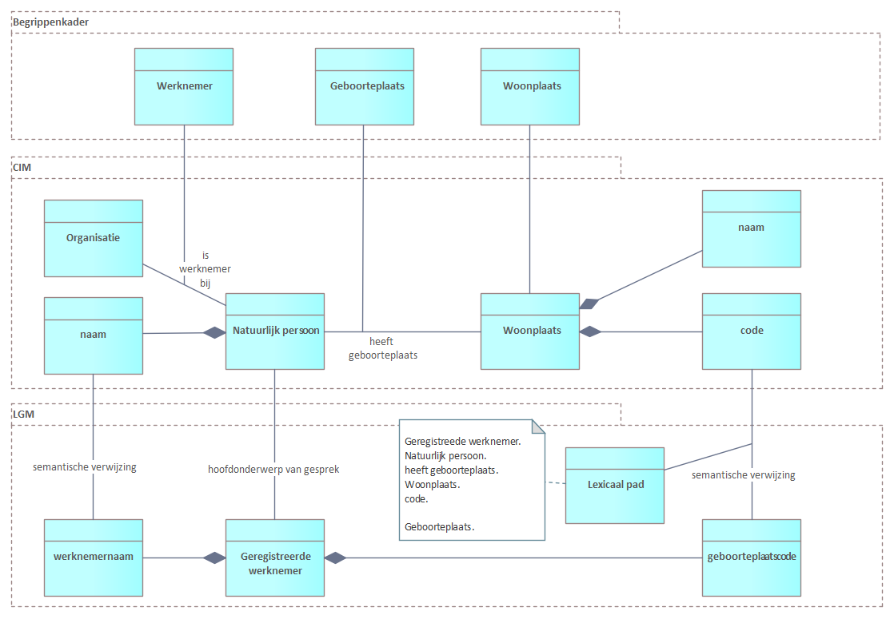

# Semantische herleidbaarheid

In dit hoofdstuk maakt u kennis met het onderwerp. 

Uitgangspunt is dat elk modelelelement uit een (MIM) model een eigen definitie kent. Deze definitie staat op zichzelf en is zodanig opgesteld dat deze past bij het beschouwingsniveau dat uitgewerkt is in het betreffende model. Semantische herleidbaarheid is hierop een _aanvullende specificatie_, die de modelelementen en definities uit de verschillende modellen met elkaar verbindt. 

## Voorbeeld 1

Neem bij voorbeeld een attribute '**bsn**' in een logisch gegevensmodel met als definitie: de identificatie van een geregistreerd persoon. 

In dit voorbeeld is de bijbehorende semantische herleiding als volgt: 
- **bsn** is een _gegevenstype_ dat onderdeel uitmaakt van het _gegevensobjecttype GeregistreerdNP_ in een logisch gegevensmodel;
- voorgaande is gebaseerd op modelelementen die in een conceptueel informatiemodel zijn uitgewerkt, te weten een _objecttype Ingeschrevene_, met een _eigenschaptype burgerservicenummer_, waarbij de Ingeschrevene een _specialisatie is van  objecttype Natuurlijk persoon_ (niet elke natuurlijk persoon is een ingeschrevene);
- voorgaande is gebaseerd op begrippen zoals: _begrip natuurlijk persoon_, een _begrip ingeschrevene_, en een _begrip burgerservicenummer_;
- deze begrippen zelf kunnen weer gebaseerd zijn op gepubliceerde brondocumenten, zoals in dit voorbeeld _het Burgerlijk Wetboek_ en de _Wet algemene bepalingen burgerservicenummer_.

Opmerking: met dit voorbeeld wordt niet bedoeld dat er altijd sprake is of moet zijn van wet- en regelgeving. Er zijn vele domeinen waarbij dit niet of minder van belang is. 

Voorgaande samenhang noemen we ook wel verticale lineage of afkomstrelaties tussen de modelelementen in de verschillende beschouwingsniveaus. Hierbij kan ook aangegeven worden of herleidbaarheid wel of niet exact is, en wel of niet compleet is.  

In de modellering van een domein onderscheidt MIM verschillende beschouwingsniveaus. Bijvoorbeeld van begrip naar conceptueel naar logisch naar fysieke implementatie. Omdat dit aparte lagen zijn is het van belang om de relatie tussen de lagen te kunnen beschrijven op het niveau van de individuele informatie-elementen. Er onstaat hiermee een systematiek van 'voortbouwende en uitbreidende' specificatie waarbij de afkomstrelaties traceerbaar en bruikbaar zijn van begrips- tot dataniveau, of eigenlijk van dataniveau terug naar begripsniveau. 

Dit document beperkt zich hierbij qua scope tot de MIM modellen zelf: 
- van een conceptuele informatiemodel naar de bijbehorende semantiek, zoals bijvoorbeeld een begrippenkader (dat bijvoorbeeld uitgewerkt is in de NL-SBB standaard)
- van een logisch gegevensmodel naar een conceptueel informatiemodel

Tot slot is het van belang om op te merken dat het aanbrengen van semantische herleidbaarheid best complex kan zijn. Denk aan: 
- dat definities niet altijd gebaseerd zijn op eigen kennis en definities. Het komt voor dat de bovenliggende semantiek wordt bepaald door andere organisaties;  
- dat definities niet geheel op elkaar aansluiten en het goed zou zijn om dit verschil zichtbaar te maken. 
- dat het niet mogelijk is om naar een modelelement in een model van een bovenliggende MIM laag te verwijzen, omdat bijvoorbeeld een conceptueel informatiemodel nog niet gemaakt is of er nog geen begrippenkader is opgesteld of gepubliceerd. Het kan dan nuttig of nodig zijn om rechtstreeks naar een begrip of kennisbron te verwijzen.

Met dit soort situaties wordt rekening gehouden. Deze zijn meegenomen in deze uitwerking (in scope) waardoor het ook mogelijkheid is om te beschrijven dat we te maken hebben met een niet ideale situatie. 

## Opstellen van goede definities

Een begrippenkader met begrippen en een conceptueel informatiemodel (CIM) kunnen gebruikt worden om te komen tot een welgevormde definitie van een gegevenstype die goed leesbaar en ook nog steed heel helder is voor gebruikers. Hierbij wordt zowel gekeken naar definities en naar semantische herleidbaarheid, beide horen bij elkaar. De laatste is een aanvulling op de eerste. Het doel is telkens om betekenis van elementen op ieder beschouwingsniveau uit te drukken met een welgevormde verwoording van die betekenis met een definitie en om hierna semantische verwijzingen aan te geven waarop de tekst van deze definitie is gebaseerd. 

Dit wordt uitgewerkt aan de hand van een voorbeeld. 

### Voorbeeld 2

In dit voorbeeld is een begrippenkader uitgewerkt naar een CIM en beide weer zijn gebruikt bij het maken van gegevensobjecttype en een gegevenstype in een LGM. 

**Begrippen in een begrippenkader:**

- Werknemer: Een werknemer is een natuurlijk persoon die werkt voor een organisatie. 
- Woonplaats: Een woonplaats is een afgebakend grondgebied met een eigen begrenzing dat gelegen is binnen het grondgebied van een gemeente, dat onder andere bestemd is voor bewoning door mensen.
- Geboorteplaats: Een geboorteplaats is de plaats waar een natuurlijk persoon is geboren, in Nederland is dit altijd een woonplaats. 

**Modelelementen in een CIM:** 

- een objecttype _Natuurlijk persoon_
   - een relatietype '_is geboren in_'
      - Deze relatie ligt tussen objecttype Natuurlijk Persoon en een objecttype Woonplaats.
      - De rol die een plaats speelt in deze relatie is dat deze de _geboorteplaats_ is van de natuurlijk persoon.
   - een relatietype '_werkt bij_'
      - Deze relatie ligt tussen objecttype Natuurlijk Persoon en een objecttype Organisatie.
      - De rol die een natuurlijk persoon speelt in deze relatie is dat deze de _werknemer_ is van de organisatie
- een objecttype _Woonplaats_
   - een eigenschaptype 'naam', met definitie: De officiele naam van een Woonlaats.
   - een eigenschaptype 'code', met definitie: De code is de officiele identificatie van een Woonplaats

**Modelelementen in een LGM:**

Het model beschrijft een aantal gegevens die bijgehouden worden over werknemers die werken bij de eigen organisatie, in een registratie die enkele van deze gegevens uitwisselt met gebruikers: 

- een gegevensobjecttype _Geregistreerde werknemer_
   - een aantal gegevenstypen betreffende de naam en een werknemersnummer (maar deze worden niet nader uitgewerkt in het voorbeeld) 
   - een attribuuttype 'geboorteplaatscode' --> deze wordt uitgewerkt in onderstaand voorbeeld

Merk op dat het gegeven in geboorteplaatscode gaat over het gegevenstype: code van woonplaats. Het gegevenstype had dus ook woonplaats of code kunnen heten, maar dat is onvoldoende helder als het gaat om de geboorteplaats van de werknemer. Om soortgelijke redenen is ook niet de term geboorteplaats gebruikt maar geboorteplaatscode, om aan te geven dat het gegevenstype over de code gaat en niet over de naam van de woonplaats. Dit zorgt ervoor dat het logische gegevensmodel niet verwarrend is. Echter, er is geen begrip met de voorkeursterm geboorteplaatscode. 
  
Vraag: wat is nou een goede definitie van het gegevenstype geboorteplaatscode? 

Een antwoord kan zijn om deze uit de in het CIM gedefinieerde code te halen: de officiele identificatie van een Woonplaats. We raken dan echter relevante context kwijt, te weten dat het om de geboorteplaats gaat. 

Een ander antwoord zou daarom kunnen zijn om de definitie van het begrip geboorteplaats te gebruiken: een woonplaats waar een natuurlijk persoon is geboren. Maar het gegeven zelf gaat over de code ervan, dus dat klopt ook niet echt. 

Laten we daarom eerst kijken naar de semantische herleidbaarheid, gebruik makende van de bijbehorende concepten uit het vorige hoofdstuk.

**Semantische herleidbaarheid van het gegevenstype geboorteplaatscode:**

- onderwerp van gesprek: Natuurlijk persoon uit het CIM
   - niet zomaar een Natuurlijk persoon, maar een natuurlijk persoon die een werknemer is bij onze organisatie
- eigenschaptype: 'code' van Woonplaats uit het CIM 
   - lexicaal pad: de geboorteplaats van een natuurlijk persoon, in CIM termen: de rol die de woonplaats speelt in de relatie met een natuurlijk persoon (en dit is wat anders dan waar de persoon woont)

Merk op dat alleen de code van de woonplaats niet duidelijk maakt dat het om de geboorteplaats van een natuurlijk persoon gaat, het onderwerp van gesprek van dit gegevenstype is de natuurlijk persoon (niet de woonplaats). Het lexicale pad verbind het eigenschaptype code van woonplaats met het onderwerp van gesprek. 

Wanneer we de semantische herleidbaarheid beschouwen als onderdeel van een formele specificatie, en de oorspronklijke definities van de betrokken begrippen hierin subtitueren dan zou de formele definitie zijn: 
'De code is de officiele identificatie van een Woonplaats.' die de 'Een geboorteplaats is een plaats waar een natuurlijk persoon is geboren, in Nederland is dit altijd een woonplaats.' van een 'Natuurlijk persoon' die 'Een werknemer is een natuurlijk persoon die werkt voor een organisatie.' is bij onze 'Organisatie. Merk op dat Natuurlijk persoon' en 'Organisatie' ook nog uitgeschreven kunnen worden. 

Dit is heel exact, maar niet goed leesbaar. Merk ook op dat er extra woorden nodig zijn zoals 'die de' en 'van een' en 'is bij'. Semantische herleidbaarheid letterlijk uitschrijven levert meestal geen goed leesbare definities op voor de doelgroep van een model. Het is dan ook niet gebruikelijk om een definitie van een gegevenstype in een gegevensmodel op deze manier uit te schrijven. Het moet daarom altijd mogelijk zijn eigen verwoordingen toe te kennen. 

**Definitie van het gegevenstype geboorteplaatscode:**

Semantische herleidbaarheid is erg nuttig om te komen tot een goede definitie. Hiervan gebruik makende komen we tot teksten zoals: 
- De geboorteplaatscode is de code van de woonplaats die de geboorteplaats is van de natuurlijk persoon die werknemer is bij onze organisatie. 
- De geboorteplaatscode is de code van de woonplaats waarin een werknemer van onze organisatie is geboren.

Beide zijn heel helder. De eerste volgt zo veel als mogelijk de semantische herleidbaarheid. De tweede is ook heel helder en is nog prettiger leesbaar voor mensen. Deze beide verwoordingen zijn daarom goed. 

Althans, dit is zo wanneer _semantische herleidbaarheid_ ook is aangebracht **in aanvulling op** de _definitie van het gegevenstype_. Met de gespecificeerde semantische verwijzingen zijn dan _alle_ bijbehorende begrippen terug vinden en kan het bijbehorende CIM bestudeerd worden om te duiden of het om hieribj een eigenschaptype of relatietype of objecttype of iets anders gaat. Zo vinden we terug: 
- de begrippen: werknemer, woonplaats en geboorteplaats uit het begrippenkader
- extra begrippen die relevant zijn zoals natuurlijk persoon en organisatie
- aanvullend geeft het CIM aan dat er sprake is van een code van een woonplaats en dat de geboorteplaats een rol is die ingevuld wordt door een woonplaats. 

Wat er met het gegevenstype 'geboorteplaatscode' bedoeld wordt is dan volledig helder. Merk ook op dat hoe meer er gewerkt wordt met specialistische begrippen, of hoe meer "platgeslagen" een logisch gegevensmodel is opgezet, hoe belangrijker een goede definitie met bijbehorende semantische herleidbaarheid wordt. 

Tot dusver het voorbeeld. In de volgende hoofdstukken wordt nader uitgewerkt hoe semantische herleidbaarheid precies gespecificeerd wordt. Merk op dat dit per modeltype verschillend is zijn omdat semantische verwijzingen in een CIM naar begrippen verwijzen en in LGM naar CIM modelelementen en van daaruit naar begrippen. Het doel is hierbij echter telkens hetzelfde. 
