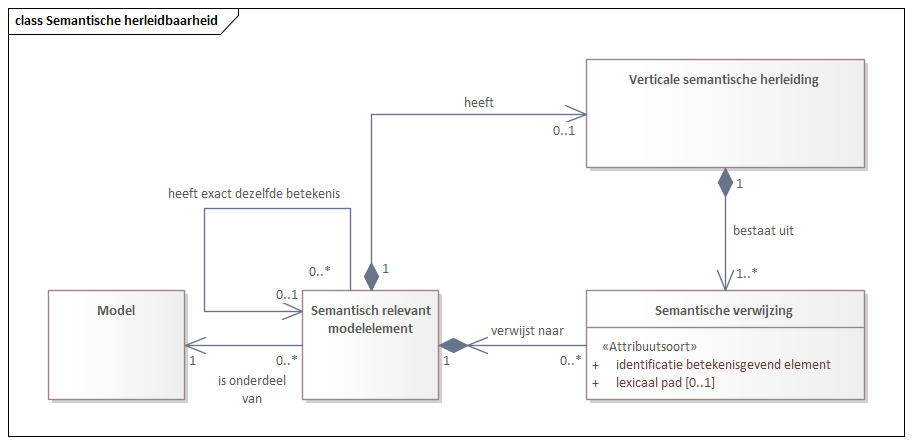

# Termen, definities en afkortingen

Dit hoofdstuk beschrijft de belangrijkste termen om semantische herleidbaarheid te begrijpen. Deze worden in de specificatie van het hoofdstuk hierna gebruikt. 

## Model van semantische herleidbaarheid

Centraal bij semantische herleidbaarheid staat het **semantisch relevant modelelement**. Dit is een modelelement waarvoor het zinvol en nodig is om deze te verbinden met bovenliggende semantiek uit een CIM en/of begrippenkader. Anders gezegd, de definitie van een semantisch relevant modelelement wordt zo goed als mogelijk in verband gebracht met bovenliggende definities, door de **semantische herleiding** ervoor te beschrijven. 

Semantische herleiding kan verticaal en horizontaal aangebracht worden. 
- verticaal geeft aan dat er verwijzingen naar CIM modelelementen en/of begrippen uit een begrippenkader worden benoemd;
- horizontaal geeft aan dat de semantische herleiding al elders is beschreven, in een model van hetzelfde MIM-niveau, en het modelelement in het eigen model er qua betekenis mee gelijk gesteld wordt.  

Semantische herleiding bestaat uit één of meerdere **semantische verwijzingen**. De set van verwijzingen kan _wel of niet compleet_ zijn om er de gegevensdefinitie mee af te dekken. Aanvullend kan de bovenliggende definitie waarnaar verwezen wordt, hierbij elke verwijzing op zichzelf beschouwend, _wel of niet exact_ in overeenstemming zijn met de tekstuele verwoording van de gegevensdefinitie. 

*Semantische herleidbaarheid in een diagram.*

**TODO Frans, vervangen door nieuwe versie.**

Dit diagram geeft herleidbaarheid weer tussen verschillende beschouwingsniveaus op generieke wijze. Het kan zijn dat er per beschouwingsniveau (LGM --> CIM en/of CIM --> begrippenkader en/of LGM --> begrippenkader). Opmerking: er loopt een issue over wellicht andere termen. 

Dit diagram zal per modelelement concreet worden uitgewerkt in het volgende hoofdstuk. 

Hieronder worden de begrippen beschreven die nodig zijn om semantische herleidbaarheid te begrijpen.

## Termen, definities

_Algemene_

| Term             | Definitie                                   | Toelichting                         |
| ---------------- | ------------------------------------------------- | ------------------------------------------------------------------------ |
| semantische herleidbaarheid	| Semantische herleidbaarheid is het vermogen om definities van modelelementen uit lagere beschouwingsniveaus expliciet en traceerbaar te verbinden met de  betekenis die met begrippen is vastgelegd in het semantische beschouwingsniveau. | Semantische herleidbaarheid is in opzet 'verticaal', dat wil zeggen dat we deze vormgeven door het aanbrengen van semantische verwijzingen tussen modelelementen uit modellen op de verschillende beschouwingsniveaus, van technische modellen naar logische modellen naar conceptuele modellen naar semantische modellen (die zelf weer gebasseerd kunnen zijn op bovenliggende kennisbronnen). | 	
| verticale semantische verwijzing |	Een semantische verwijzing naar een modelelement uit een hogerliggend beschouwingsniveau.	| Wanneer de beschouwingsniveaus boven elkaar worden afgebeeld, lopen deze semantische verwijzingen verticaal naar boven. | 
| horizontale semantische verwijzing | Een semantische gelijkstelling, door middel van een semantische verwijzing naar een ander gelijkgetypeerd modelelement in een ander model op hetzelfde beschouwingsniveau. | Hiermee wordt aangegeven: de semantische herleidbaarheid van dit gegevenstype is exact gelijk aan die van een ander gegevenstype in een ander gegevensmodel, kijk voor de semantische herleidbaarheid naar bovenliggende definities daar. Deze verwijzing is niet 'verticaal' (tussen beschouwingsniveaus), maar 'horizontaal', binnen hetzelfde beschouwingsniveau. Deze semantische verwijzing is vooral onderkend om aan te geven dat een gegevenstype in een gegevensmodel van een gegevensuitwisseling qua betekenis exact overeenkomt met een gegevenstype in een administratie van waaruit gegevens zijn gebruikt voor een informatieproduct of zijn overgenomen naar een kopie. Vaak loopt deze herleidbaarheid gelijk op met een logistieke herleidbaarheid (datalineage, waar het gegeven vandaan komt). | 
| semantisch relevant modelelement | Een modelelement waarvoor het nuttig of noodzakelijk is dat de definitie grotendeels gebaseerd is op bovenliggende definities uit het semantische beschouwingsniveau. | Hiermee wordt aangegeven dat het de bedoeling is dat begrippen uit een begrippenkader worden gebruikt in de definitie van dit modelelement in een CIM of LGM. Dit gebruik hoeft niet tekstueel exact te zijn. Hiermee wordt niet aangegeven dat er een begrippenkader of CIM ontbreekt, ook als deze er niet zijn kan aangegeven worden dat een modelelement semantisch relevant is. Een voorbeeld van een niet relevant modelelement is bv. een volgnummer om iets in de techniek uniek te maken of een betekenisloos hulpgegeven om iets aan te sturen of iets te koppelen. |  
| gegevensdefinitie | De beschrijving van de betekenis van dit modelelement, zijnd een gegevenstype of gegevensobjecttype. | Dit komt overeen met het metagegeven 'Definitie' uit MIM-1.2. (!) | 
| gegevensspecificatie | Het totaal van verplichte en optionele metagegevens die in MIM aan een modelelement toegekend kunnen worden aan een gegevenstype of gegevensobjecttype.| Het gaat hier om onderkende modelelementen, in MIM of in een MIM-extensie. |
| semantiek | zie begrippenkader | De MIM-1 laag |  

_Detaillering van semantische herleidbaarheid_

Een gegevensdefinitie kan gebruik maken van meerdere begrippen en soms zelfs uit meerdere modelelementen uit een CIM (bijvoorbeeld een adresregel en een uitkomst van een berekening). Het is echter niet altijd zo dat er een begrippenkader of een CIM is om naar te verwijzen, of deels wel en deels niet. Soms klopt een definitie van een modelelement uit een onderliggende beschouwingsniveau ook wel ongeveer maar niet exact met de bovenliggende definities uit een bovenliggend beschouwingsniveau. 

Dit komt onder andere vanwege dat een begrippenkader (MIM-1) en een CIM (MIM-2) aangeven hoe iets bedoeld is en een LGM (MIM-3) en een implementatiemodel (MIM-4) gebaseerd zijn op welke gegevens er daadwerkelijk geadministreerd zijn en/of uitgewisseld worden en ook rekening houdt met de soms weerbarstige praktijk van het inwinnen van gegevens. 

Er kunnen dus, bedoeld of onbedoeld, verschillen zitten tussen de definities van de modelelementen uit verschillende beschouwingsniveaus. Dit kan leiden tot het elkaar niet goed begrijpen en spraakverwarring. Door semantische herleidbaarheid in detail uit te werken wordt inzichtelijk hoe het precies zit. Met al deze aspecten wordt rekening gehouden bij het uitwerken van semantische herleidbaarheid. 

| Term             | Definitie                                   | Toelichting      | 
| ---------------- | ------------------------------------------------- | ------------------------------------------------------------------------ |
| complete semantische herleiding | Een duiding van dat alle relevante semantische verwijzingen zijn aangebracht op een semantisch relevant modelelement. | Er ontbreekt er geen (ook niet vanwege het ontbreken van een CIM of een begrippenkader). Wanneer de herleiding niet compleet is dan is er altijd sprake van ten minste 1 ontbrekende verwijzing, die er wel zou moeten zijn om de gehele gegevensdefinitie af te dekken. Als de gehele gegevensdefinitie afgedekt wordt dan ontbreken er geen verwijzingen en is de herleiding dus compleet. |
| exacte semantische verwijzing | Een duiding dat de definitie van dit semantische relevant modelelement en de betekenis waarnaar via alleen deze semantische verwijzing naar verwezen wordt exact met elkaar in overeenstemming zijn. | Bij de semantische verwijzing wordt aangegeven of deze exact is. De verwoording, van het CIM modelelement of begrip, kan net anders zijn, maar dit heeft geen invloed op de betekenis. De strekking is 1 op 1 hetzelfde. Wanneer er meerdere verwijzingen nodig zijn, dan betreft het exact overeenstemmen alleen deze betreffende verwijzing en het gedeelte van de gegevensdefinitie die hierbij hoort. |
| volledige semantische herleiding  | De semantische herleiding is compleet en alle semantische verwijzingen zijn exact. | **Volledig = compleet en exact**. De gegevensdefinitie kan volledig verklaard worden via de betekenis die te vinden is via de semantische verwijzingen en is daarmee in overeenstemming. De verwoording is mogelijk net anders, maar de betekenis is hetzelfde (semantisch equivalent). |
| verklaring van verschil | De beschrijving van het semantische verschil tussen de betekenis van de modelelementen waarnaar verwezen wordt vanuit de semantische herleiding en de gegevensdefinitie. | Deze zijn niet semantisch equivalent met elkaar, er is sprake van een wezenlijk verschil. De verklaring geeft aan wat het verschil is, om hiermee gebruikers van gegevens inzicht te bieden. De oorzaak ligt in het feit dat bovenliggende semantiek niet voldoende matcht met de gegevensdefinitie (het gegevensmodel klopt niet goed met het CIM en/of begrippenkader). Doorgaans zal het zo zijn dat het wenselijk is om dit verschil een keer op te gaan lossen, zeker wanneer het verschil per ongeluk is ontstaan. Als semantische herleiding compleet en exact is, dan is het nooit nodig om een verklaring van verschil te beschrijven.  | 
| uitleg verschil in verwoording | De beschrijving van het verschil in verwoording van de betekenis van de modelelementen waarnaar verwezen wordt vanuit de semantische herleiding en de gegevensdefinitie, terwijl de betekenis wel hetzelfde is. | Er is geen sprake van een semantisch verschil. De betekenis is semantisch equivalent, maar er is wel gebruik gemaakt van andere woorden. Het is niet nodig om punten en komma's en verbindingswoorden uit te leggen. De uitleg is nuttig voor de lezers van de gegevensdefinitie, die wel een verschil in woorden zien, en gerustgesteld willen worden dat er slechts sprake is van een andere verwoording. | 
| semantisch niet relevant | Een duiding dat een modelelement semantisch niet relevant is, er hoeft geen semantische herleiding te worden aangebracht. | Voor dit soort modelelementen kan expliciet aangegeven worden dat deze semantisch niet relevant zijn, oftewel niet in een CIM of begrippenkader horen. Semantisch niet relevante modelelementen hebben uiteraard wel een gegevensdefinitie, bij alle getypeerde gegevens hoort immers een gegevensdefinitie. Een voorbeeld van een niet semantisch relevant modelelement zou bijvoorbeeld kunnen zijn: een hulpgegeven t.b.v. routering, een modelelement dat modelmatig nodig is maar geen semantiek heeft, een technisch hulpgegeven zoals een record id die e.e.a. koppelt in de implementatie maar niet uitgewisseld behoort te worden richting gebruikers. Merk op: het kan voorkomen dat een modelelement wel semantisch relevant is, maar dat er nog geen herleidbaarheid voor is aangebracht. Gebruik dan: ontbrekende semantische herleiding. | 

_Specifiek voor logische gegevensmodellen_

| Term             | Definitie                                   | Toelichting                              |
| ---------------- | ------------------------------------------------- | ------------------------------------------------------------------------ |
| onderwerp	van gesprek | Een onderwerp van gesprek geeft het objecttype of het relatietype aan waarvoor een gegevensobjecttype is ingericht. | Bijvoorbeeld: een gegevensobjecttype geregistreerdNatuurlijkPersoon heeft als onderwerp van gesprek het objecttype Ingeschrevene. De gegevens in het gegevensobject gaan over een object of exemplaar van dit objecttype, ook als het gegeven bijvoorbeeld een naam is van een plaats, want het gaat dan om de woonplaats die de ingeschrevene hanteert als woonadres. Er staat daarom in de definitie bewust 'waarvoor', en niet 'waarmee'. Merk op dat als in het CIM staat dan een natuurlijk persoon maar 1 woonadres kan hebben, dan hoort het gegevensobject er ook maar 1 te hebben (op 1 moment in de tijd). De achtergrond van onderwerp van gesprek is dat voor elk gegeven het helder moet zijn om welke eigenschap het gaat en vanuit welk object dit beschouwd wordt, zie definitie van 'gegeven' en van 'gegevenstype'. Het is mogelijk om per gegevenstype een onderwerp van gesprek bij te houden, maar omdat dit in principe altijd hetzelfde is voor hetzelfde gegevensobject wordt dit metagegeven bij het gegevensobjecttype bijgehouden. Een eigenschaptype in een CIM heeft op zich ook een onderwerp van gesprek, maar dat is altijd het object dat getypeerd is d.m.v. het objecttype zelf. Daarom wordt dit verder niet uitgemodelleerd. |  
| lexicaal pad		| Een lexicaal pad is de specificatie van de route tussen een gegevenstype en het bijbehorende eigenschaptype in een conceptueel informatiemodel waarnaar de semantische verwijzing gelegd is, waarbij de route uitgedrukt is m.b.v. de lexicale namen van de betrokken modelelementen van de route. | Meestal hoort er bij 1 gegevensobjecttype ook 1 objecttype en hoort er bij 1 gegevenstype ook 1 eigenschaptype van dit objecttype. Er is dan niet echt sprake van een route of pad door het CIM, alleen maar van een verwijzing naar een eigenschaptype in het CIM. Het komt echter ook voor dat er wel pad door het CIM gelopen wordt, via een of meerdere relatietypen en objecttypen, vertrekkend vanuit het onderwerp van gesprek. Zie ook het voorbeeld aan het begin van dit hoofdstuk. Dan is de specificatie van het lexicale pad noodzakelijk om exact aan te geven hoe de semantische herleiding precies in elkaar zit. Elke semantische verwijzing heeft 0 of 1 lexicaal pad, nooit meerdere. Aangezien 1 gegevenstype wel meerdere semantische verwijzingen kan hebben (bv. een adresregel) kan bij 1 gegevenstype wel sprake zijn van meerdere lexicale paden.  
| gegevensdefinitie	| Een gegevensdefinitie is de beschrijving van de betekenis die hoort bij een gegevenstype. | Het betreft de officiele gegevensdefinitie die in de praktijk gehanteerd wordt door gebruikers, zoals beschreven in officiele koppelvlakdocumentatie of interfaces. Het betreft hier niet een alternatieve B1 taalniveau verwoording en ook invulinstructies horen niet in de gegevensdefintie te worden opgenomen. Indien voor een gegevenstype semantische herleidbaarheid is aangebracht kan de gegevensdefinitie aan de hand hiervan uitgewerkt worden. Let wel, wanneer alle definities uit bovenliggende modellen erbij worden gepakt dan ontstaat niet altijd direct een welgevormde verwoording van die betekenis die bruikbaar is voor lezers van het gegevensmodel en een dergelijke verwoording is wel nuttig en nodig. Het is deze verwoording die de gegevensdefinitie is. Nota bene: het is mogelijk dat semantische herleidbaarheid niet compleet en/of niet exact is en dat de gegevensdefinitie die in de praktijk gebruikt wordt afwijkt van de bovenliggende definities. Geef dit dan aan d.m.v. een verklaring van verschil (doe niet net alsof het wel klopt). | 

Overige:

In MIM 1.2 kunnen logische modelelementen gekoppeld aan een modelelement uit een conceptueel informatiemodel, met behulp van het metagegeven `mim:begrip`. 
De definitie daarvan luidt:  

In MIM 1.2 kunnen logische modelelementen gekoppeld aan een begrip met behulp van het metagegeven `mim:begrip`. 
De definitie daarvan luidt: 

## Afkortingen

|                   |                                                                                                                                            |
| ----------------- | ----------------------------------------------------------------------------------------------------------------------------------------------------- |
| CIM     | Conceptueel Informatiemodel      |  
| LGM     | Logisch gegevensmodel      |                                                                                                             
| MIM     | Metamodel informatiemodellering        |
